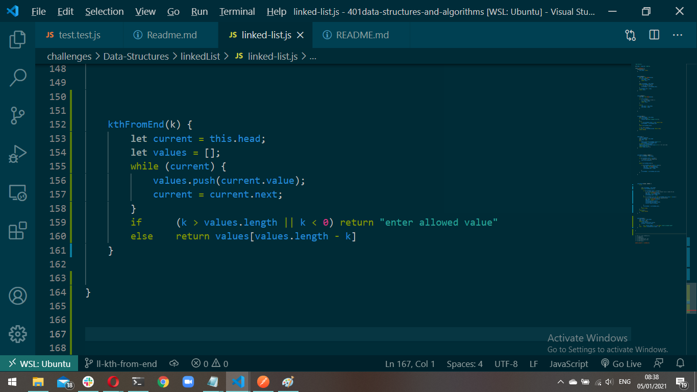

# Challenge Summary
k-th value from the end of a linked list.

## Challenge Description
Write a method for the Linked List class which takes a number, k, as a parameter. Return the node’s value that is k from the end of the linked list. You have access to the Node class and all the properties on the Linked List class as well as the methods created in previous challenges.

## Approach & Efficiency
I used while loop to loop over the linked list nodes and stored the values in array and then brung the element that has the index [arr.length - k];
*complexity*
- space big O(n): i used an array
- time: big O(n) i used a while loop

## Solution

* Don't hate me I will complete the whiteboard :$