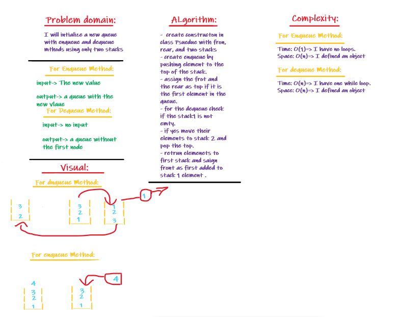

# Challenge Summary
Implement a Queue using two Stacks.

## Challenge Description
Create a brand new PseudoQueue class. Do not use an existing Queue. Instead, this PseudoQueue class will implement our standard queue interface (the two methods listed below), but will internally only utilize 2 Stack objects. Ensure that you create your class with the following methods:
  * enqueue(value) which inserts value into the PseudoQueue, using a first-in, first-out approach.
  * dequeue() which extracts a value from the PseudoQueue, using a first-in, first-out approach.

## Approach & Efficiency
- for enqueue I used pushed on the top of the stack 
- for the dequeue: I looped over the first stack and pop all elements to another one then remove first one and return them back to it.

## Solution
