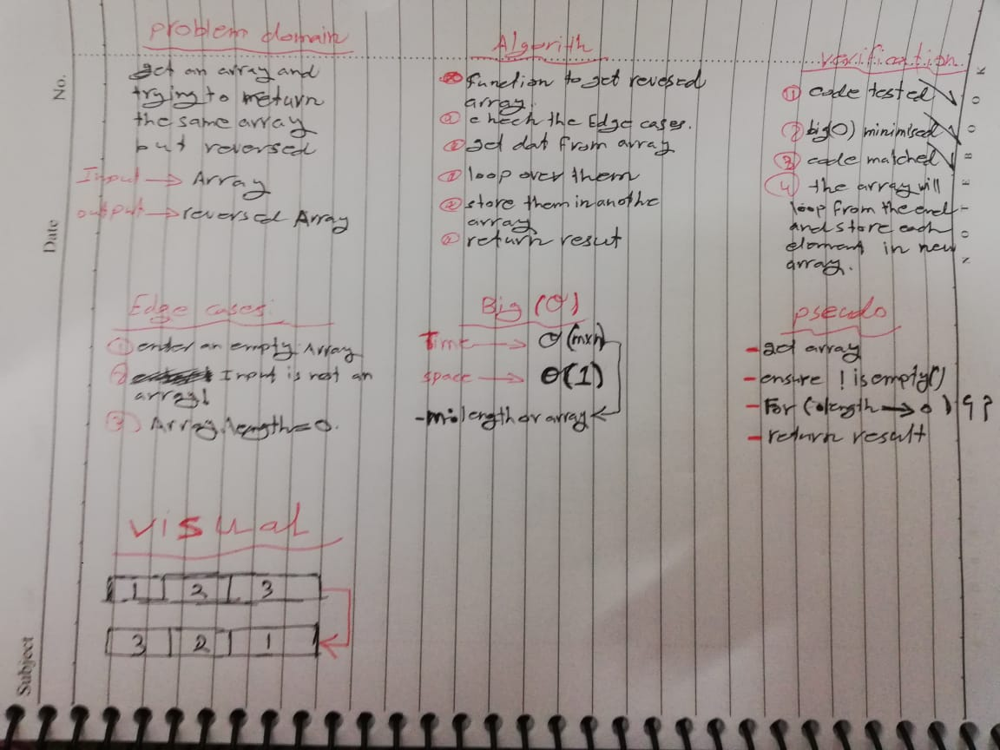
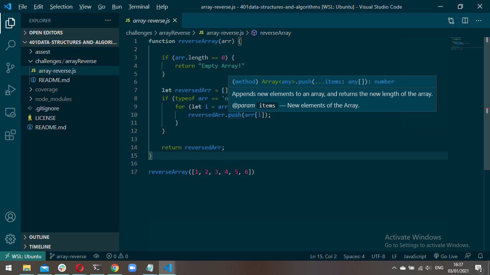

# Reverse an Array
- code challenge 1

## Challenge
<!-- descreption from challenge -->
a function called reverseArray which takes an array as an argument. Without utilizing any of the built-in methods available to your language, return an array with elements in reversed order.

## Approach & Efficiency
<!-- for loop or while + big o -->
- I used one for loop with one if statment.
- *big o()* : 
  * space : big O(n) because I got an array
  * Time : big O(n) because I only got one array.

## Solution

