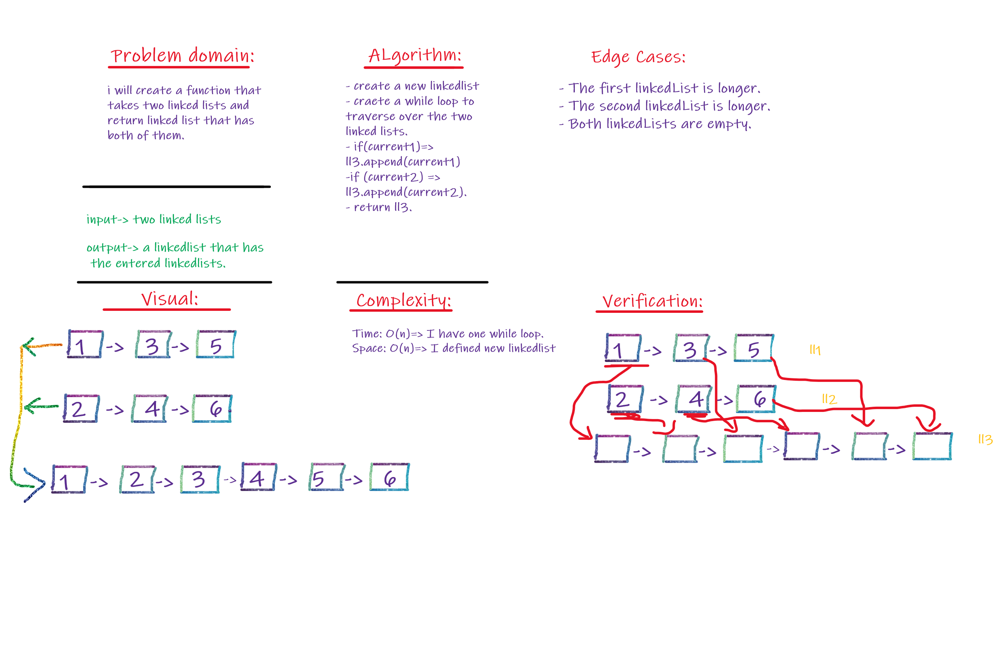
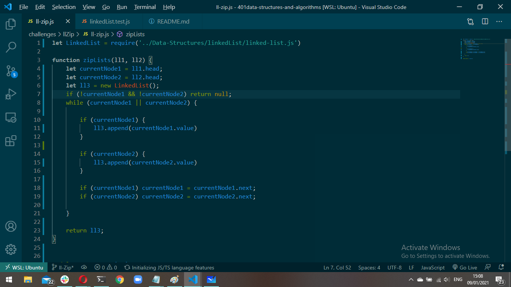

# Challenge Summary
Zip two linked lists.

## Challenge Description
Write a function called zipLists which takes two linked lists as arguments. Zip the two linked lists together into one so that the nodes alternate between the two lists and return a reference to the head of the zipped list. Try and keep additional space down to O(1). You have access to the Node class and all the properties on the Linked List class as well as the methods created in previous challenges.

## Approach & Efficiency
* I defined new linked list and appended the elements from each linkedList to the new linkedList.

* complexity: 
  - Time: O(n)=> I have while loop.
  - Space: O(n) => I defined a new linkedList

## Solution:

.
