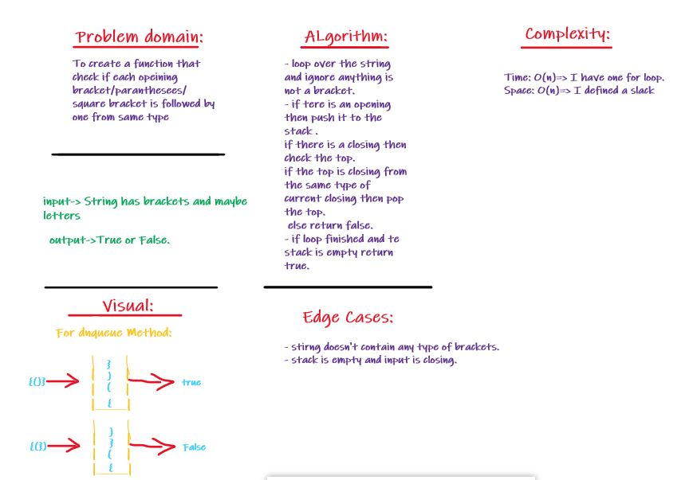

# Challenge Summary
- Multi-bracket Validation.
## Challenge Description
- function should take a string as its only argument, and should return a boolean representing whether or not the brackets in the string are balanced. There are 3 types of brackets:
  1. Round Brackets : ()
  2. Square Brackets : [] 
  3. Curly Brackets : {}

## Approach & Efficiency
- I used a while loop to go over the string and check if the input charachter is an opening I push it to the stack .
- If it is closing I check the top of stack if it is opening for this input, if yes=> pop .. if no=> return false
- If the loop finished and stack is empty then return true.
- else return false.

## Solution
