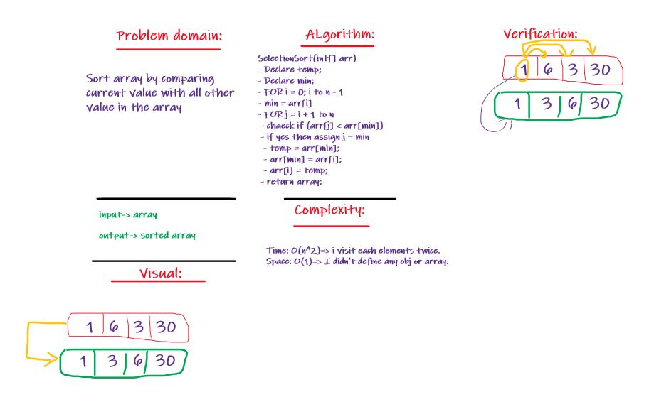

# Challenge Summary
Selection Sort

## Challenge Description
Sort array by comparing current value with all other value in the array

## Approach & Efficiency
I looped over it sing two for loops one to move over the whole eements and another one to compare the current one with the others.
-Space : O(1) ==> I didn't define any obj or array.
- Time: O(n^2)

## Solution:

